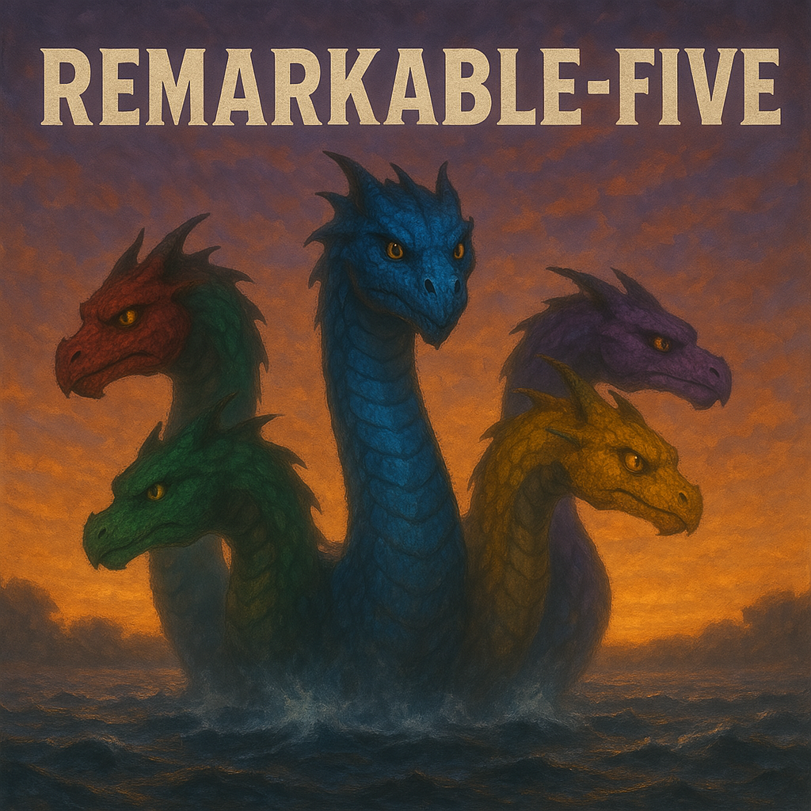

# Remarkable-Five

Remarkable-Five is an efficient, (yet to be determined) x.yB-parameter causal language model built using a novel RMKV (Recurrent Memory Key-Value) architecture. The project is designed to train stably on limited hardware (an Nvidia RTX 5000 with less than 30 GB of GPU memory), while achieving strong instruction-following performance specifically tailored for creative writing and story generation.

## Overview

Remarkable Five leverages a hybrid approach by combining Transformer-style QKV attention with a recurrent memory mechanism. This allows the model to:
- **Efficiently Handle Long Contexts:** Use a fixed number of memory tokens with learnable query vectors to capture long-range dependencies across text segments.
- **Support Extremely Long Sequences:** Optionally use sinusoidal positional encoding that can scale to sequences up to 128K tokens.
- **Implement Robust Causal Generation:** Use a sophisticated causal masking system where memory tokens can attend globally while regular tokens adhere to causal constraints.
- **Leverage Flexible Memory Updates:** Choose between GRU, LSTM, or a lightweight MinimalRNN cell for recurrent memory updates.
- **Train with Limited Resources:** Achieve competitive performance with a 1.2B-parameter model that can train on commodity hardware (an Nvidia RTX 5000 with less than 30 GB of GPU memory).
- **Excel at Creative Tasks:** The architecture is specifically optimized for instruction-following in creative writing and story generation tasks.

## Project Structure

```
remarkable_five/
├── README.md                   # This file -- Project overview and instructions
├── architecture.md             # Description of architecture
├── requirements.txt            # Python dependencies
├── config.py                   # Hyperparameters and configuration settings
├── run.py                      # Run the model for inference (multiple modes)
├── train_hf.py                 # Train the model using HuggingFace datasets
├── train_tokenizer_hf.py       # Train the tokenizer with mixed data sources
├── checkpoints/
│   ├── rmkv_pretrain_step_.pt # Pretraining checkpoints
│   ├── rmkv_finetune_step_.pt # Finetuning checkpoints
│   ├── rmkv_pretrain_final.pt  # Final pretraining checkpoint
│   ├── rmkv_finetune_final.pt  # Final finetuning checkpoint
│   ├── rmkv_latest.pt          # General latest checkpoint
│   └── tokenizer.json          # Trained tokenizer
├── logs/
│   └── *.log                   # Training logs
├── model/
│   ├── init.py
│   └── rmkv.py                 # RMKV model architecture definition
├── data/
│   ├── init.py
│   └── tokenizer.py            # Custom BPE tokenizer
├── training/
│   ├── init.py
│   └── checkpoint.py           # Model checkpoint save/load functions
└── inference/
├── init.py
└── infer.py                # Inference and text generation logic
```

## Setup

1. **Clone the repository:**
   ```bash
   git clone <repository_url> remarkable_five
   cd remarkable_five
   ```

2. **Install dependencies:**
   Use https://pytorch.org/get-started/locally/ to determine torch install, for me it is:
   ```bash
   pip3 install torch torchvision torchaudio --index-url https://download.pytorch.org/whl/cu124
   pip install -r requirements.txt
   ```

3. **Create necessary directories:**
   Running the project (e.g., via `python config.py` or the training script) will create the needed directories for data, checkpoints, and logs.

## Usage

### Training
Train tokenizer:
```bash
python train_tokenizer_hf.py --vocab_size 30000 --max_samples 250000
```

#### Pretraining
To start pretraining the RMKV model from scratch:
```bash
python train.py --mode pretrain
```

To resume pretraining from the latest checkpoint:
```bash
python train.py --mode pretrain
```
(You'll be prompted to confirm if you want to resume)

To restart pretraining from scratch (removing existing checkpoints):
```bash
python train.py --mode pretrain
```
(Answer 'Y' when prompted to restart)

#### Finetuning
To start finetuning after pretraining:
```bash
python train.py --mode finetune
```
This will automatically use the latest pretraining checkpoint.

To specify a particular checkpoint for finetuning:
```bash
python train.py --mode finetune --checkpoint checkpoints/rmkv_pretrain_epoch_10.pt
```

To continue finetuning from a previous finetuning run:
```bash
python train.py --mode finetune
```
(You'll be prompted to confirm if you want to resume)

To reset epoch counting when loading a checkpoint:
```bash
python train.py --mode finetune --checkpoint checkpoints/rmkv_pretrain_latest.pt --reset_epochs
```

#### Using Custom Data Directories
To specify a custom data directory:
```bash
python train.py --mode pretrain --data_dir /path/to/pretrain_data
python train.py --mode finetune --data_dir /path/to/finetune_data
```

### Inference

To run interactive inference in chat mode (persistent memory and history):
```
python run.py --mode chat --temperature 0.7 --top_p 0.9
```
To run in instruct mode (persistent memory only):
```
python run.py --mode instruct --temperature 0.7
```
To process a single prompt:
```
python run.py --mode single --prompt "Write a story about a robot discovering emotions." --temperature 0.8
```

## Training Configuration
The model uses an efficient streaming data approach that combines multiple data sources:

* Fineweb dataset: General web text for broad language understanding (primary source for pretraining)
* Reasoning dataset: Structured reasoning examples with think-aloud problem solving
* Nemotron dataset: Specialized instruction data covering code, math, science, and chat domains

This mixed-source approach with configurable ratios allows balancing general knowledge with specialized capabilities. The training pipeline supports:

* Interleaved streaming: Data is streamed and mixed on-the-fly to avoid loading entire datasets into memory
* Weighted sampling: Different data sources are sampled at configured ratios (e.g., 5:1:1 for pretraining)
* Dynamic iteration: Training can continue indefinitely on streaming data or set to a fixed number of steps

The model uses different configurations for pretraining and finetuning:

- **Pretraining**: Higher learning rate, larger batch size, more epochs
- **Finetuning**: Lower learning rate, smaller batch size, fewer epochs, stricter gradient clipping

These configurations can be adjusted in `config.py`.

## Contributing

Contributions are welcome! Please open an issue or submit a pull request if you have ideas or improvements for the project.

## License

MIT

---